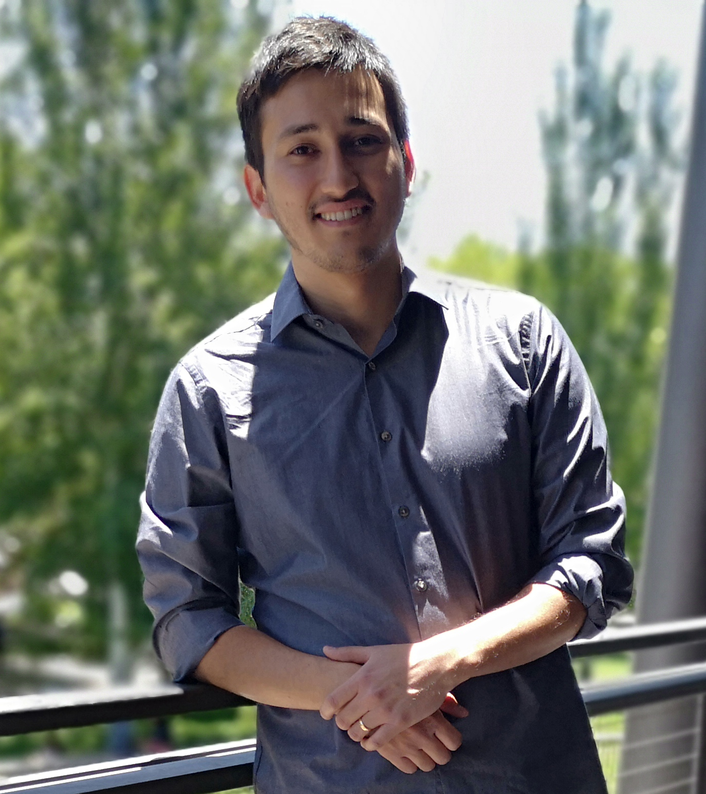

# Big Problems for Small Networks: Statistical Analysis of Small Networks and Team Performance

**Speaker**: [George G. Vega Yon](https://ggvy.cl)

**Abstract**: Small network data such as team, family, or personal networks, is common in many
fields that study social networks. Although the analysis of small networks may
appear simplistic relative to the difficulties posed by "big" datasets, there are
at least two key challenges: (1) fitting statistical models to explain the network
structure in small groups, and (2) testing if structural properties of small
networks are associated with group-level outcomes; for example, team performance.
In this presentation, we introduce two new statistical methods that use a revisited
version of Exponential Random Graph Models (ERGMs) in the context of small networks.
Using exhaustive enumeration of networks in the support, we are able to calculate
exact likelihood functions for ERGMs, which allows us to obtain maximum likelihood
estimates directly (without using simulations), avoiding common problems that
arise from methods that rely on approximations instead. This is joint work with
[Prof. Kayla de la Haye (USC)](https://www.kayladelahaye.net/).

Slides available [here](talk/index.pdf) ([handout](talk/ggvy-nu2019-talk-handout.pdf))

# Workshop

A workshop on the R packages [ergmito](https://github.com/muriteams/ergmito) and
[gnet](https://github.com/muriteams/gnet) for applying the methods introduced
during the talk will be conducted on location and time TBA.

Workshop materials available [here](workshop) ([source code](workshop/index.Rmd))

# About the Speaker

[George G. Vega Yon](https://ggvy.cl) is a Biostatistics Ph.D student and Research Programmer in
the Department of Preventive Medicine at USC's Keck School of Medicine. His
interests are in computational statistics and scientific software development.
Most recently, his research has focused on the development of statistical
methods for both [phylogenetics](https://ggvy.cl/project/aphylo/)
and [social network analysis](https://github.com/muriteams/ergmito#ergmito-estimation-of-little-ergms-using-exact-likelihood).
He holds a MS degree in Economics from Caltech, and a MA in Economics and
Public Policy from Universidad Adolfo Ibáñez, Chile.

