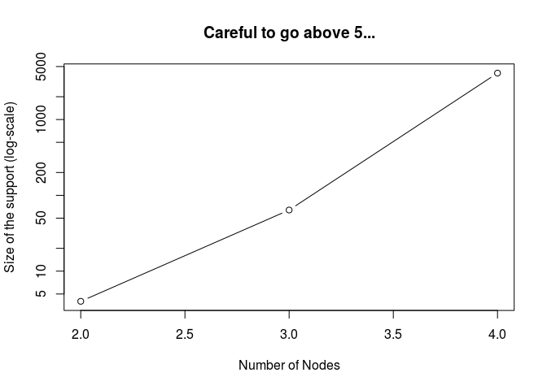

A quick introduction to the ergmito R package
================
George G Vega Yon
March 20, 2019

## Installing `ergmito`

Follow the instructions available on github
<https://github.com/muriteams/ergmito>

## Likelihood

  - The `ergmito` package’s core function consists on the likelihood
    function

  - The function itself is a wrapper of `ergm::ergm.allstats` which
    returns exactly that: all the statistics of a graph of a given size.

  - One important detail: We are not calculating exactly the same
    function as the one observed in the formula for ERGMs, we are using
    the fact that **isomorphism** occurs farily often, so instead we
    used weights:

## Optimization

  - The `ergmito` function works in the following way:
    
    1.  Reads in the data and creates a log-likelihood function together
        with the corresponding gradient function.
    
    2.  Uses the `stats::optim` function in R to maximize the
        log-likelihood. Some details:
        
        1.  Uses the “BFGS” algorithm for optimization (standard in R)
        
        2.  Instead of approximating the gradient, we pass the true
            analytical gradient (since log-likelihood can be computed
            exactly, so this can be).
        
        3.  Solves the same optimization problem 5 times (see the
            `ntries` parameter) just to make sure that we are getting a
            maximum.
    
    The last point after experiencing some convergence issues in the
    optmization algorithms which were not yielding consistent results.
    Earlier we were using the limited memory bounded version of BFGS
    which turned out not to be very appropiate for us.

## Example 1: The fivenets network

  - This network was generated using the sampler function available in
    the package (`ergmito::new_rergmito`)

  - The population parameters in this dataset are `par[edges] = -2.0`
    and `par[nodematch.female] = 0.2`.

  - We are going to try to recover the original parameters
    
    ``` r
    library(ergmito)
    
    data("fivenets", package="ergmito")
    
    (model0 <- ergmito(fivenets ~ edges))
    ```
    
        ## 
        ## ERGMito estimates
        ## 
        ##  Coefficients:
        ##   edges  
        ## -0.6931

  - Let’s take a look at what the object of class `ergmito` includes:
    
    ``` r
    str(model0, max.level = 1)
    ```
    
        ## List of 12
        ##  $ call      : language ergmito(model = fivenets ~ edges)
        ##  $ coef      : Named num -0.693
        ##   ..- attr(*, "names")= chr "edges"
        ##  $ iterations: Named int 12
        ##   ..- attr(*, "names")= chr "function"
        ##  $ mle.lik   :Class 'logLik' : -38 (df=1)
        ##  $ null.lik  :Class 'logLik' : -42 (df=0)
        ##  $ covar     : num [1, 1] 0.075
        ##   ..- attr(*, "dimnames")=List of 2
        ##  $ coef.init : num [1:5, 1] 0.5703 0.7606 -0.3605 1.8318 -0.0475
        ##  $ formulae  :List of 7
        ##   ..- attr(*, "class")= chr "ergmito_loglik"
        ##  $ nobs      : num 60
        ##  $ network   :List of 5
        ##  $ init      : num [1:5, 1] 0.5703 0.7606 -0.3605 1.8318 -0.0475
        ##  $ optim.out :List of 6
        ##  - attr(*, "class")= chr [1:2] "ergmito" "ergm"
    
    The `optim.out` component is what the `stats::optim` function
    returns
    
    ``` r
    str(model0$optim.out)
    ```
    
        ## List of 6
        ##  $ par        : Named num -0.693
        ##   ..- attr(*, "names")= chr "edges"
        ##  $ value      : num -38.2
        ##  $ counts     : Named int [1:2] 12 7
        ##   ..- attr(*, "names")= chr [1:2] "function" "gradient"
        ##  $ convergence: int 0
        ##  $ message    : NULL
        ##  $ hessian    : num [1, 1] -13.3
    
    The `formulae` object is what actually holds the log-likelihood
    function and the gradient. It actually has its own print method:
    
    ``` r
    model0$formulae
    ```
    
        ## ergmito log-likelihood function
        ## Number of networks:  5 
        ## Model:  fivenets ~ edges 
        ## Available elements by using the $ operator:
        ## loglik: function (params, stats = NULL) grad  : function (params, stats = NULL)

  - We can use the different methods available for `ergmito` class
    object:
    
    ``` r
    confint(model0)
    ```
    
        ##           2.5 %     97.5 %
        ## edges -1.229905 -0.1563889
    
    ``` r
    vcov(model0)
    ```
    
        ##       edges
        ## edges 0.075
    
    ``` r
    logLik(model0)
    ```
    
        ## 'log Lik.' -38.19085 (df=1)
    
    ``` r
    AIC(model0)
    ```
    
        ## [1] 78.3817
    
    ``` r
    BIC(model0)
    ```
    
        ## [1] 80.47604
    
    ``` r
    summary(model0)
    ```
    
        ## $coefs
        ##         Estimate Std. Error   z value   Pr(>|z|)
        ## edges -0.6931472  0.2738613 -2.531016 0.01137328
        ## 
        ## $aic
        ## [1] 78.3817
        ## 
        ## $bic
        ## [1] 80.47604
        ## 
        ## $model
        ## [1] "fivenets ~ edges"
        ## 
        ## attr(,"class")
        ## [1] "ergmito_summary"
    
    ``` r
    nobs(model0)
    ```
    
        ## [1] 60

  - Now, let’s try to fit other models. We will store the results and
    try to add them up together in a single output table
    
    ``` r
    model1 <- ergmito(fivenets ~ edges + ttriad)
    model2 <- ergmito(fivenets ~ edges + nodeicov("female"))
    model3 <- ergmito(fivenets ~ edges + nodematch("female"))
    ```

  - Furthermore, the package includes methods for the
    [**texreg**](http://github.com/leifeld/texreg/) R package, so we can
    export lists of fitted models directly
    
    ``` r
    library(texreg)
    htmlreg(
      l       = list(Baseline = model0, Balance = model1, icovFemale = model2, Homophily = model3),
      doctype = FALSE,
      caption = "My first ergmito table"
      )
    ```
    
    <table cellspacing="0" align="center" style="border: none;">
    
    <caption align="bottom" style="margin-top:0.3em;">
    
    My first ergmito
    table
    
    </caption>
    
    <tr>
    
    <th style="text-align: left; border-top: 2px solid black; border-bottom: 1px solid black; padding-right: 12px;">
    
    <b></b>
    
    </th>
    
    <th style="text-align: left; border-top: 2px solid black; border-bottom: 1px solid black; padding-right: 12px;">
    
    <b>Baseline</b>
    
    </th>
    
    <th style="text-align: left; border-top: 2px solid black; border-bottom: 1px solid black; padding-right: 12px;">
    
    <b>Balance</b>
    
    </th>
    
    <th style="text-align: left; border-top: 2px solid black; border-bottom: 1px solid black; padding-right: 12px;">
    
    <b>icovFemale</b>
    
    </th>
    
    <th style="text-align: left; border-top: 2px solid black; border-bottom: 1px solid black; padding-right: 12px;">
    
    <b>Homophily</b>
    
    </th>
    
    </tr>
    
    <tr>
    
    <td style="padding-right: 12px; border: none;">
    
    edges
    
    </td>
    
    <td style="padding-right: 12px; border: none;">
    
    \-0.69<sup style="vertical-align: 0px;">\*</sup>
    
    </td>
    
    <td style="padding-right: 12px; border: none;">
    
    \-0.90<sup style="vertical-align: 0px;">\*</sup>
    
    </td>
    
    <td style="padding-right: 12px; border: none;">
    
    \-0.31
    
    </td>
    
    <td style="padding-right: 12px; border: none;">
    
    \-1.70<sup style="vertical-align: 0px;">\*\*</sup>
    
    </td>
    
    </tr>
    
    <tr>
    
    <td style="padding-right: 12px; border: none;">
    
    </td>
    
    <td style="padding-right: 12px; border: none;">
    
    (0.27)
    
    </td>
    
    <td style="padding-right: 12px; border: none;">
    
    (0.39)
    
    </td>
    
    <td style="padding-right: 12px; border: none;">
    
    (0.35)
    
    </td>
    
    <td style="padding-right: 12px; border: none;">
    
    (0.54)
    
    </td>
    
    </tr>
    
    <tr>
    
    <td style="padding-right: 12px; border: none;">
    
    ttriple
    
    </td>
    
    <td style="padding-right: 12px; border: none;">
    
    </td>
    
    <td style="padding-right: 12px; border: none;">
    
    0.27
    
    </td>
    
    <td style="padding-right: 12px; border: none;">
    
    </td>
    
    <td style="padding-right: 12px; border: none;">
    
    </td>
    
    </tr>
    
    <tr>
    
    <td style="padding-right: 12px; border: none;">
    
    </td>
    
    <td style="padding-right: 12px; border: none;">
    
    </td>
    
    <td style="padding-right: 12px; border: none;">
    
    (0.36)
    
    </td>
    
    <td style="padding-right: 12px; border: none;">
    
    </td>
    
    <td style="padding-right: 12px; border: none;">
    
    </td>
    
    </tr>
    
    <tr>
    
    <td style="padding-right: 12px; border: none;">
    
    nodeicov.female
    
    </td>
    
    <td style="padding-right: 12px; border: none;">
    
    </td>
    
    <td style="padding-right: 12px; border: none;">
    
    </td>
    
    <td style="padding-right: 12px; border: none;">
    
    \-0.95
    
    </td>
    
    <td style="padding-right: 12px; border: none;">
    
    </td>
    
    </tr>
    
    <tr>
    
    <td style="padding-right: 12px; border: none;">
    
    </td>
    
    <td style="padding-right: 12px; border: none;">
    
    </td>
    
    <td style="padding-right: 12px; border: none;">
    
    </td>
    
    <td style="padding-right: 12px; border: none;">
    
    (0.58)
    
    </td>
    
    <td style="padding-right: 12px; border: none;">
    
    </td>
    
    </tr>
    
    <tr>
    
    <td style="padding-right: 12px; border: none;">
    
    nodematch.female
    
    </td>
    
    <td style="padding-right: 12px; border: none;">
    
    </td>
    
    <td style="padding-right: 12px; border: none;">
    
    </td>
    
    <td style="padding-right: 12px; border: none;">
    
    </td>
    
    <td style="padding-right: 12px; border: none;">
    
    1.59<sup style="vertical-align: 0px;">\*</sup>
    
    </td>
    
    </tr>
    
    <tr>
    
    <td style="padding-right: 12px; border: none;">
    
    </td>
    
    <td style="padding-right: 12px; border: none;">
    
    </td>
    
    <td style="padding-right: 12px; border: none;">
    
    </td>
    
    <td style="padding-right: 12px; border: none;">
    
    </td>
    
    <td style="padding-right: 12px; border: none;">
    
    (0.64)
    
    </td>
    
    </tr>
    
    <tr>
    
    <td style="border-top: 1px solid black;">
    
    AIC
    
    </td>
    
    <td style="border-top: 1px solid black;">
    
    78.38
    
    </td>
    
    <td style="border-top: 1px solid black;">
    
    79.93
    
    </td>
    
    <td style="border-top: 1px solid black;">
    
    77.59
    
    </td>
    
    <td style="border-top: 1px solid black;">
    
    73.34
    
    </td>
    
    </tr>
    
    <tr>
    
    <td style="padding-right: 12px; border: none;">
    
    BIC
    
    </td>
    
    <td style="padding-right: 12px; border: none;">
    
    80.48
    
    </td>
    
    <td style="padding-right: 12px; border: none;">
    
    84.12
    
    </td>
    
    <td style="padding-right: 12px; border: none;">
    
    81.78
    
    </td>
    
    <td style="padding-right: 12px; border: none;">
    
    77.53
    
    </td>
    
    </tr>
    
    <tr>
    
    <td style="padding-right: 12px; border: none;">
    
    Log Likelihood
    
    </td>
    
    <td style="padding-right: 12px; border: none;">
    
    \-38.19
    
    </td>
    
    <td style="padding-right: 12px; border: none;">
    
    \-37.96
    
    </td>
    
    <td style="padding-right: 12px; border: none;">
    
    \-36.80
    
    </td>
    
    <td style="padding-right: 12px; border: none;">
    
    \-34.67
    
    </td>
    
    </tr>
    
    <tr>
    
    <td style="border-bottom: 2px solid black;">
    
    Num.
    networks
    
    </td>
    
    <td style="border-bottom: 2px solid black;">
    
    5
    
    </td>
    
    <td style="border-bottom: 2px solid black;">
    
    5
    
    </td>
    
    <td style="border-bottom: 2px solid black;">
    
    5
    
    </td>
    
    <td style="border-bottom: 2px solid black;">
    
    5
    
    </td>
    
    </tr>
    
    <tr>
    
    <td style="padding-right: 12px; border: none;" colspan="6">
    
    <span style="font-size:0.8em"><sup style="vertical-align: 0px;">***</sup>p
    \< 0.001, <sup style="vertical-align: 0px;">**</sup>p \< 0.01,
    <sup style="vertical-align: 0px;">*</sup>p \< 0.05</span>
    
    </td>
    
    </tr>
    
    </table>

## Simulating networks

  - An important part of the current implementation of the sampling
    function is been able to generate the support of the graphs, this
    is, the power set of size \(2^{n(n-1)}\) in the case of directed
    graphs.

  - The function `powerset` does exactly that. Let’s check it out:
    
    In the simplest case (2 individuals), we have 4 possible networks:
    
    ``` r
    powerset(2) 
    ```
    
        ## [[1]]
        ##      [,1] [,2]
        ## [1,]    0    0
        ## [2,]    1    0
        ## 
        ## [[2]]
        ##      [,1] [,2]
        ## [1,]    0    1
        ## [2,]    1    0
        ## 
        ## [[3]]
        ##      [,1] [,2]
        ## [1,]    0    1
        ## [2,]    0    0
        ## 
        ## [[4]]
        ##      [,1] [,2]
        ## [1,]    0    0
        ## [2,]    0    0
    
    But the number of networks starts increasing fast,
    e.g.
    
    ``` r
    sizes <- c(length(powerset(2)), length(powerset(3)), length(powerset(4)))
    plot(
      y=sizes, x=2:4, log="y", type="b",
      ylab = "Size of the support (log-scale)",
      xlab = "Number of Nodes",
      main = "Careful to go above 5..."
      )
    ```
    
    <!-- -->

  - Using this function, the function `new_rergmito` creates an object
    of class `ergmito_sampler` that can be used to draw samples from
    little ERGMs fast. Let’s see a simple example for a network of size
    4
    
    ``` r
    sampler0 <- new_rergmito(rbernoulli(4) ~ edges, theta = c(-1), sizes = 4)
    
    # How close do we get to the population parameter -1 with 50 networks
    set.seed(1)
    dat <- sampler0$sample(50, s = 4)
    summary(ergmito(dat ~ edges))
    ```
    
        ## $coefs
        ##         Estimate Std. Error   z value     Pr(>|z|)
        ## edges -0.9116287 0.09027958 -10.09784 5.647248e-24
        ## 
        ## $aic
        ## [1] 720.968
        ## 
        ## $bic
        ## [1] 725.365
        ## 
        ## $model
        ## [1] "dat ~ edges"
        ## 
        ## attr(,"class")
        ## [1] "ergmito_summary"
    
    How about making it a bit more complex, let’s throw in transitive
    triads
    
    ``` r
    sampler1 <- new_rergmito(rbernoulli(4) ~ edges + ttriad, theta = c(-2, 1))
    
    set.seed(1)
    dat <- sampler1$sample(50, s = 4)
    summary(ergmito(dat ~ edges + ttriad))
    ```
    
        ## $coefs
        ##           Estimate Std. Error   z value     Pr(>|z|)
        ## edges   -1.8446903 0.10842678 -17.01324 6.551717e-65
        ## ttriple  0.9397177 0.05045033  18.62659 1.955893e-77
        ## 
        ## $aic
        ## [1] 520.8601
        ## 
        ## $bic
        ## [1] 529.654
        ## 
        ## $model
        ## [1] "dat ~ edges + ttriad"
        ## 
        ## attr(,"class")
        ## [1] "ergmito_summary"

  - In some cases we would like to generate more complex samplers using,
    for example, other sufficient statistics. While all `ergm` terms are
    available, not all are available efficiently; only those listed in
    `count_stats` have vectorized
        versions:
    
    ``` r
    AVAILABLE_STATS() # the statistics listed here can be computed fast
    ```
    
        ##  [1] "mutual"    "edges"     "ttriad"    "ctriad"    "nodeicov" 
        ##  [6] "nodeocov"  "nodematch" "triangle"  "balance"   "t300"     
        ## [11] "t102"

## Counting network statistics

  - A significant part of `ergmito` is about counting sufficient
    statistics.

  - In the `ergm` package, the function `ergm::summary_formula` provides
    a way of doing such. The problem with it is that it was not designed
    to be vectorized.

  - Our function `count_stats()` does so in an efficient way, so we can
    count stats in al list of adjacency matrices fast
    
    ``` r
    pset4 <- powerset(4)
    system.time({ans0 <- count_stats(pset4, "ttriad")})
    ```
    
        ##    user  system elapsed 
        ##   0.000   0.000   0.002
    
    ``` r
    system.time({ans1 <- sapply(pset4, function(i) ergm::summary_formula(i ~ ttriad))})
    ```
    
        ##    user  system elapsed 
        ##   6.812   0.000   6.813
    
    ``` r
    # Are we getting the same?
    identical(as.vector(ans0), unname(ans1))
    ```
    
        ## [1] TRUE

  - As mentioned in the previous section, the list of available
    statistics is provided by `AVAILABLE_STATS()`.
